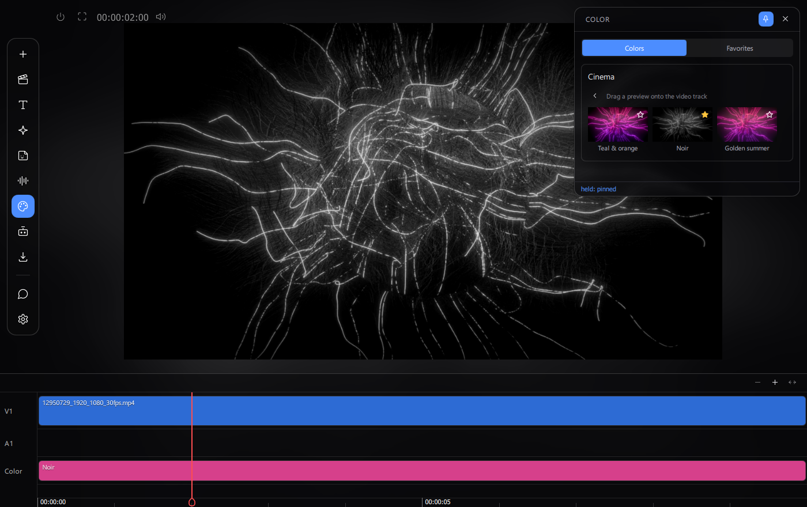
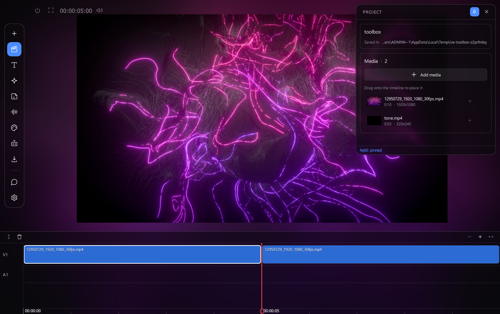
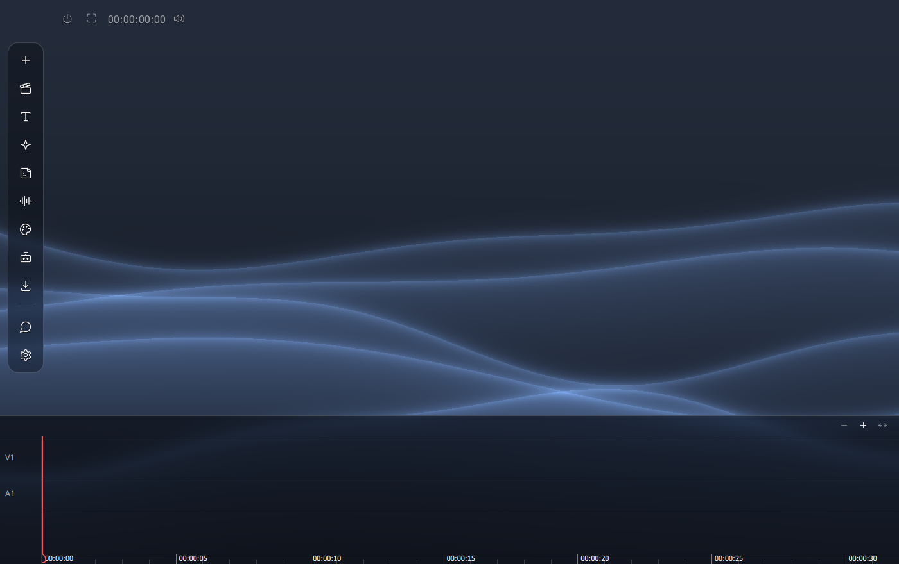

# IVE — Individual Video Editor

**⚠️ Work in progress — this project is still being designed and written.**
It is not ready for everyday use yet: expect missing features, rough edges
and breaking changes between commits.

A free, open-source desktop video editor for **Windows and Linux**, with a
CapCut-style workflow: a timeline-centric interface, fast everyday
operations, and creative tools that anyone can extend **without writing
code** and share with other users as plain files.

> **Status: early development (alpha).** The editor opens projects, plays
> and edits multi-clip timelines with audio, applies colour effects and
> exports video. Many features are still on the way — see the roadmap
> below. macOS is not supported for now (untested; the codebase avoids
> platform-specific paths, so it may come later).


*Colour effects: families, live previews on your own footage, favourites,
and a pink clip on the dedicated Color lane.*


*The timeline: media pool with real thumbnails, drag to place, trim with
snapping, split, per-clip volume.*


*The idle screen: PS4-style waves, computed per pixel on the GPU.*

## Why another editor?

Commercial editors are approachable but closed: their music, effects and
presets live behind an account and a paywall. Professional open-source
editors are powerful but demand a learning curve. IVE aims at the gap
between the two, on Windows and Linux:

- **Approachable first.** Full-screen immersive interface, drag-and-drop
  editing, one-click social export presets.
- **Extensible by anyone.** Colour effects, export presets and (soon)
  music, stickers and transitions are **declarative JSON files** — copy a
  file into a folder and it is installed; send it to a friend and they
  have it too. Nothing executes, so installing content is safe.
- **AI-first architecture.** Every feature of the application is exposed
  as an *Action* with a typed schema, invokable identically from the UI,
  from scripts, and — in the future — from a natural-language assistant.
  There is no functionality reachable only by clicking.

## What works today

- Projects with a media pool (video, audio, images), thumbnails, autosave
- Multi-clip timeline: drag to place and reorder, trim with edge handles
  and snapping, split at the playhead, per-clip volume/mute, remove or
  restore a clip's audio, music (audio-only) clips
- Frame-accurate playback with audio, the audio clock driving A/V sync
- Colour effects: 14 built-in looks in 4 families, live thumbnails on your
  own footage, favourites, drag onto the timeline as a resizable clip on a
  dedicated Color lane — applied identically in preview and export
- Export: social presets (YouTube, Instagram, TikTok, ...) and a custom
  tab (container, codecs, aspect ratio, resolution, bitrate)
- Proxy editing for 4K sources; multilingual UI (EN, IT, ES, PT); dark and
  light themes

## Roadmap (short version)

Audio in the export, real waveforms, text and titles, stickers,
transitions, AI tools (auto-cut, subtitles), content packs (`.ivepack`).
The detailed plan lives in [`docs/ROADMAP.md`](docs/ROADMAP.md).

## Technology

| Area | Choice |
|---|---|
| Language | Python 3.10 |
| UI | PySide6 (Qt 6) + Qt Quick / QML, GPU scene graph |
| Media I/O | FFmpeg via [PyAV](https://github.com/PyAV-Org/PyAV) |
| Engine | Our own implementation of the **MLT model** (producers, playlists, tractor; pull-based graph). The MLT library itself is not used — its Python bindings do not exist on Windows — but the model is what makes preview and export render from the same graph. |
| Colour | Recipes compiled to LUT/matrix steps, applied by OpenCV |
| Tests | Script-style suites plus visual tests that drive the real app and assert on pixels |

Design documents (in Italian) live in [`docs/`](docs/) — architecture,
engine rules, UI identity, licensing.

## Running from source

```bash
python -m venv .venv
.venv/bin/pip install -r requirements.txt
.venv/bin/python -m ive          # from the ive/src directory on sys.path
```

On Windows use `.venv\Scripts\` equivalents. The application writes only
to its `user_data/` folder — settings, logs, caches and projects never
touch the program directory.

## Extending IVE without programming

A colour effect is a JSON file:

```json
{
  "schema_version": 1,
  "id": "my_look",
  "name": {"en": "My look"},
  "section": "cinema",
  "ops": [
    {"op": "temperature", "amount": 0.3},
    {"op": "contrast", "amount": 1.1},
    {"op": "vignette", "strength": 0.4}
  ]
}
```

Drop it in `user_data/effects/color/` and it appears in the Color panel —
or send the file to another user, who does the same. Export presets work
the same way. See [`docs/COLOR_EFFECTS.md`](docs/COLOR_EFFECTS.md).

## License

GPL-3.0-or-later. See [`docs/LICENSING.md`](docs/LICENSING.md) for the
full dependency and FFmpeg reasoning. IVE is a tool: what you import,
edit and export is your business — the app does not watermark, fingerprint,
phone home or restrict your own material in any way.
